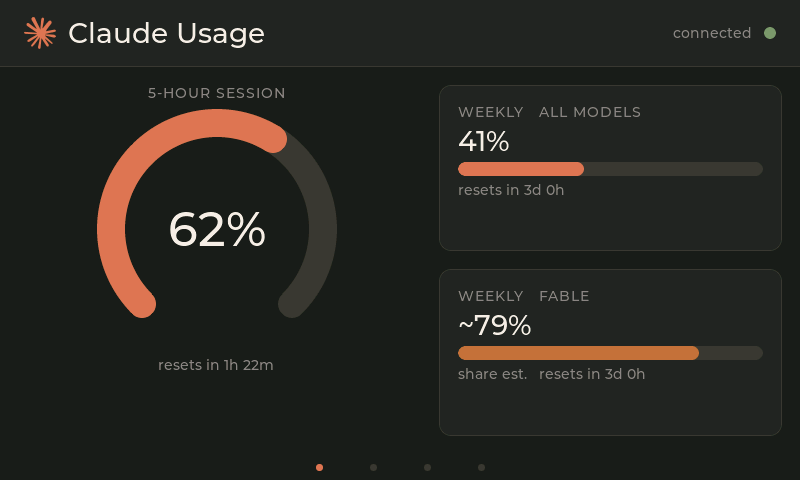
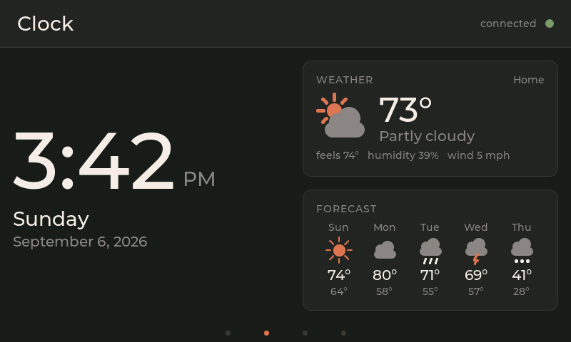
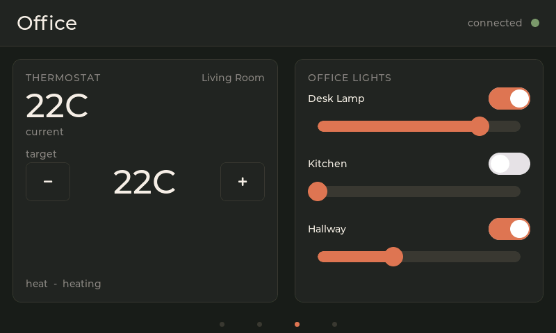
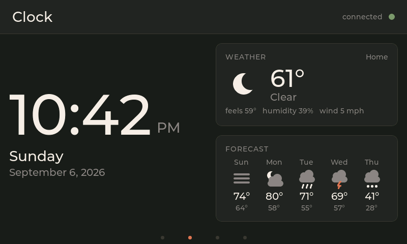
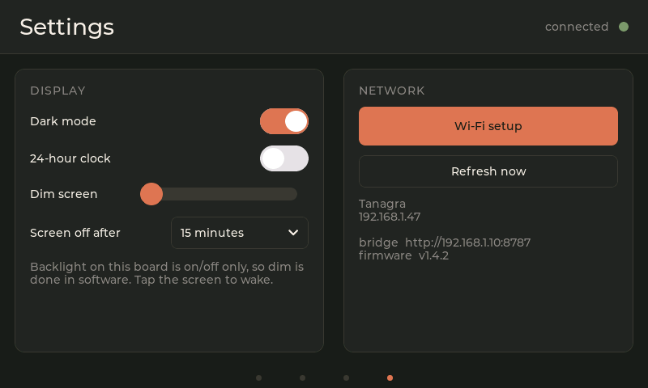
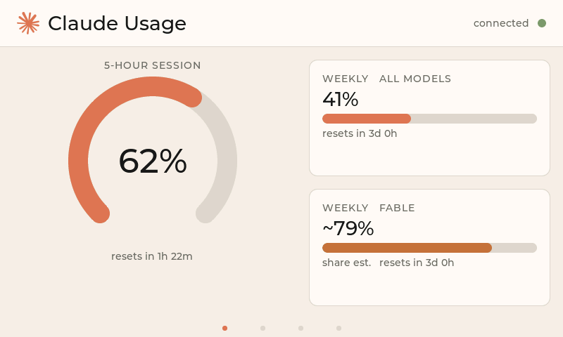
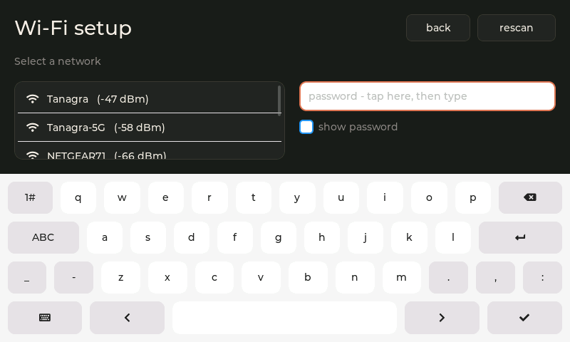
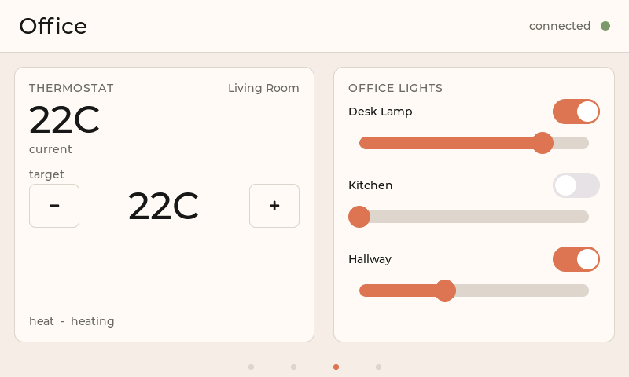
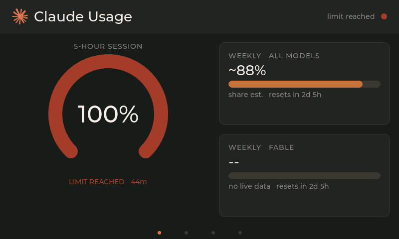

# Claude Desk Panel

A desk display for a **Waveshare ESP32-S3-Touch-LCD-4.3B** (800×480 RGB, GT911 touch):
how much of your Claude usage window you've burned through, a clock with the weather,
and Home Assistant controls. Four pages, swipe between them.



| Clock | Office |
| --- | --- |
|  |  |

| Clock at night | Settings |
| --- | --- |
|  |  |


| | |
| --- | --- |
| `bridge/` | Python, stdlib only. Serves usage JSON on the LAN and proxies Home Assistant. |
| `ui/` | The entire UI. Pure LVGL 8 / C99 — no Arduino, no ESP-IDF. |
| `sim/` | Headless renderer: builds `ui.c` with gcc, writes 800×480 PNGs. |
| `firmware/` | Board bring-up, Wi-Fi, HTTP, NVS. |
| `assets/` | Rasterises the Claude mark into an LVGL alpha map; generates the clock face. |
| `design/` | Design-canvas artboards tracing the firmware layout. |

The panel holds no credentials but your Wi-Fi password, which you type on it.

---

## The interesting part: the UI is hardware-independent

`ui/ui.c` has no Arduino, ESP-IDF or board headers. Data goes in through
`ui_set_usage()` / `ui_set_ha()` / `ui_set_weather()` / `ui_set_clock()` /
`ui_set_status()`; actions come back through a callback struct. The firmware
supplies one implementation, `sim/` supplies another.

So the same file that runs on the panel also builds on a PC and renders to PNG:

```bash
cd sim && make -j && make shots      # 16 scenarios into sim/shots/
./sim --page clock --theme light --night --out shot.png
```

A layout change is a two-second loop instead of a 35-second flash, and every state —
light theme, limit reached, bridge offline, Wi-Fi setup — can be rendered without
putting the device into it. Several real bugs were caught this way: sliders whose
knobs were clipped by the parent, tracks that stayed LVGL-blue in both themes, and
two `snprintf` truncations.

Every screenshot in this README came out of it:

| Light theme | Wi-Fi setup, on the device |
| --- | --- |
|  |  |
|  |  |

The rest are in [`docs/screenshots/`](docs/screenshots) - stale data, bridge offline,
no Wi-Fi, dimmed, the clock before its first sync.

Needs gcc. On Windows, WSL works: `sudo apt install build-essential`.

---

## Clock and weather

The panel has no idea where it is or what time it is. The PC next to it knows both,
so the bridge's `/weather` endpoint carries current conditions, a five-day forecast
**and the local time**, and the panel sets its clock from that reply every ten
minutes. No NTP, no timezone string in the firmware: DST is worked out on the PC,
and the panel keeps time from its own crystal between polls (drift is ~10 ms).

**Location.** Nothing to configure if Home Assistant is set up: the bridge reads
the house's coordinates, timezone and unit system from HA's `/api/config`. Without
HA, copy `bridge/weather_config.example.json` to `weather_config.json` and fill in
latitude, longitude and `"units": "f"` or `"c"`. Weather comes from
[Open-Meteo](https://open-meteo.com/) - free, no key, no account. Check what the
panel will see with:

```bash
python bridge/claude_usage_bridge.py --weather
```

**The glyphs are drawn, not drawn on.** Nine weather families (sun, moon, partly
cloudy day/night, cloud, fog, rain, snow, storm) are built from LVGL discs and
lines inside a fixed box, so they tint with the theme and cost no image assets.
The bridge maps WMO weather codes onto those families; the firmware never sees a
code. The 112px clock face is Montserrat, digits only, generated from the TTF that
ships inside the LVGL library by `assets/make_clock_font.ps1` (needs node).

A **24-hour clock** switch lives on the Settings page and is remembered in NVS.

---

## Where the usage numbers come from

**Use a token.** Every response from `api.anthropic.com` carries the account's
rate-limit state in headers (`anthropic-ratelimit-unified-5h-utilization` and
friends). A one-token Haiku request costs ~nothing and returns exactly what
`/usage` shows — no arithmetic, no assumed budgets, the same number Anthropic
uses to decide whether to throttle you. This is
[Clawdmeter](https://github.com/HermannBjorgvin/Clawdmeter)'s approach. Mint one
with `claude setup-token`, drop it in `bridge/token.txt`. Nothing else needed —
the bridge reads it per fetch, so no restart and no reflash.

**Without one you get an estimate, and it can be wildly wrong.** The bridge sums
weighted token usage from `~/.claude/projects/**/*.jsonl` and divides by a
hardcoded budget. Both halves are guesses:

- The numerator sees **only Claude Code on that one machine**. The web app, the
  desktop app, another laptop — all invisible.
- The denominator (50M session / 170M week / 60M model) is reverse-engineered.
  Anthropic doesn't publish the real budgets.

Measured on this panel the moment a token was added: the estimate said the
5-hour session was at **9.6%** when it was really at **45%**. It also had the
week *over*-stated (38.2% vs 30.0%) — the errors don't even share a direction,
so there is no correction factor you can apply in your head.

`--calibrate` narrows the denominator against a known-good reading, but cannot
fix the numerator:

```bash
python bridge/claude_usage_bridge.py --calibrate "session=1,week=20,model=30"
```

**Read the provenance.** Each gauge reports its own — `api`, `api-scaled`,
`calibrated`, `rejection` or `fallback` — and the panel appends `est.` under any
gauge that isn't live. Be aware how quiet that signal is: the big percentage
looks identical either way, and `est.` is small muted text under it.

Two things worth knowing:

- **The per-model gauge is never fully live.** There is no per-model header, so
  `api-scaled` takes the local logs' estimate of that model's *share* of the week
  and rescales it to the real weekly total. The total is real; the share inherits
  the one-machine blindness above.
- **Token expiry degrades silently.** On a 401 the bridge logs
  `token rejected — run claude setup-token` and the gauges drop back to
  `fallback`. The panel keeps showing confident-looking numbers.

---

## Home Assistant

Copy `bridge/ha_config.example.json` to `ha_config.json`, add your URL and a
long-lived token, then:

```bash
python bridge/claude_usage_bridge.py --ha-discover   # lists climate.* and light.*
```

Put one climate entity in `thermostat` and up to three lights in `lights`.

**The panel never names an entity.** It sends a light *index*; the bridge resolves it
against that config and rejects anything else with a 403. A device sitting on a desk,
reachable by anyone on the LAN, cannot reach an entity you did not list — verified
against out-of-scope lights and a door lock. The HA token stays on the PC.

---

## Setup

**1. Bridge** — stdlib only, no `pip install`:

```bash
python bridge/claude_usage_bridge.py
```

Allow it through the firewall for **private networks**, or the panel can't reach it.
`--once` prints the payload, `--dump` shows windows and sources.

Do this at the same time, or the panel shows guesses instead of your usage
(see [Where the usage numbers come from](#where-the-usage-numbers-come-from)):

```bash
claude setup-token          # paste the result into bridge/token.txt
```

`--dump` reports `"live_status"`: `"no token"` means you are on the estimate.

**2. Firmware** — copy `config.h.example` to `config.h` and set `BRIDGE_URL` to your
PC. Wi-Fi is configured on the device itself; the `WIFI_*` defines are fallbacks.

**3. Libraries — the versions matter:**

| Library | Version | Why pinned |
| --- | --- | --- |
| esp32 Arduino core | **3.3.11** | On 3.3.8 every Wi-Fi join fails `AUTH_EXPIRE` |
| ESP32_Display_Panel | 1.0.4 | v0.x has no preset for the boxed 4.3B; the registry copy is a stale fork with no Waveshare support |
| ESP32_IO_Expander | 1.1.1 | |
| esp-lib-utils | 0.2.3 | The registry's 0.3.0 violates Display_Panel's own range |
| lvgl | 8.4.0 | LVGL 9 is an API break |
| ArduinoJson | 7.x | |

`ui/ui.c`, `ui/ui.h`, `ui/font_clock_112.c` and the logo are copied into the sketch
folder by `build.ps1`; edit the originals.

Four config headers live in the Arduino `libraries/` root, not the sketch:
`lv_conf.h`, `esp_panel_board_supported_conf.h`, `esp_panel_drivers_conf.h`,
`esp_utils_conf.h`. Editing any of them needs a clean build.

**4. Build:**

```powershell
.\build.ps1              # compile + flash
.\build.ps1 -Clean       # after touching a header in libraries/
```

All cores, fixed build path: a warm rebuild is ~35 s. Kill any serial monitor first —
it holds the port. Board: ESP32S3 Dev Module, 16MB flash, **OPI PSRAM**, USB CDC on
boot. Download mode: hold BOOT, tap RESET, release BOOT.

---

## Hardware notes that cost real time

- **The esp32 core version is not optional.** On 3.3.8 every association fails with
  `AUTH_EXPIRE` (reason 2) — at full signal, correct password, on any router. 3.3.11
  joins first try. Days can go into blaming the router for this.
- **The CH422G I/O expander ACKs every I²C address `0x20`–`0x3F`.** Any touch library
  that identifies chips by probing will bind to the expander instead of the GT911 and
  read nonsense out of it. Use the board preset, or address the GT911 at `0x5D`
  directly. A device answering 32 consecutive addresses is the tell.
- **RGB timings are stack-specific and don't transfer.** 12 MHz pixel clock with a
  `width*20` bounce buffer stops the panel drifting under ESP32_Display_Panel — and
  produces a blank white screen under Arduino_GFX, which wants 16 MHz and `width*10`.
- **PSRAM must be OPI.** The 800×480 framebuffer is 768 KB; without it you get
  `no mem for frame buffer`, which reads like a wiring fault.
- **Sliders:** LVGL draws the knob *outside* the track on all four sides. A
  `LV_SIZE_CONTENT` parent clips it — vertically always, horizontally at 0% and 100%.

`firmware/wifi_test/` is a bare radio test (open AP + scan, no display) for splitting
radio problems from everything else. `firmware/claude_usage_widget/` is an earlier
Arduino_GFX build kept as a fallback.

---

## Credentials

`ha_config.json`, `weather_config.json`, `token.txt` and `config.h` are gitignored,
with `.example` files alongside. Nothing in this repo is a secret; check before you
commit.

## Licence

MIT.
